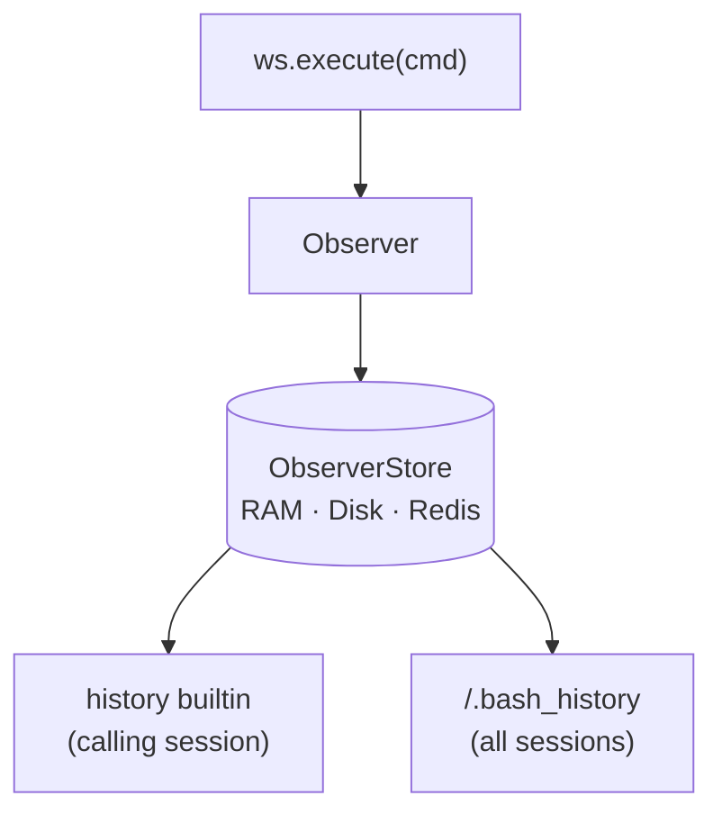

## What It Does

Every workspace has one **Observer**: a hidden recorder that logs each top-level
command and its file ops as timestamp-ordered events. It owns no mount and has no
endpoint of its own, features like command history are just *views* over its
events. Nested evals (`$(...)`, `eval`, `source`, `xargs`) run without recording,
so only real top-level commands land.



## Storage backends

The Observer holds a storage-agnostic `ObserverStore`. RAM is the default; swap it
to persist events across daemon restarts. The store is chosen at construction; there
is no runtime API to change it.

<CodeGroup>

```python Python
from mirage import Workspace, MountMode
from mirage.resource.ram import RAMResource
from mirage.observe.disk_store import DiskObserverStore
from mirage.observe.redis_store import RedisObserverStore

# RAM (default), nothing to configure
ws = Workspace({"/data": RAMResource()}, mode=MountMode.WRITE)

# Persist to disk
ws = Workspace({"/data": RAMResource()}, mode=MountMode.WRITE,
               observe=DiskObserverStore("/var/mirage/history"))

# Persist to Redis
ws = Workspace({"/data": RAMResource()}, mode=MountMode.WRITE,
               observe=RedisObserverStore("redis://localhost:6379/0"))
```

```typescript TypeScript
import { Workspace, RAMResource } from '@struktoai/mirage-core'
import { DiskObserverStore, RedisObserverStore } from '@struktoai/mirage-node'

// RAM (default), nothing to configure
const ws = new Workspace({ '/data': new RAMResource() })

// Persist to disk
const wsDisk = new Workspace(
  { '/data': new RAMResource() },
  { observe: new DiskObserverStore('/var/mirage/history') },
)

// Persist to Redis
const wsRedis = new Workspace(
  { '/data': new RAMResource() },
  { observe: new RedisObserverStore({ url: 'redis://localhost:6379/0' }) },
)
```

</CodeGroup>

## Supported: command history

The Observer powers a GNU-bash-compatible history, exposed two ways over the same
events:

| Surface | Scope | Notes |
| --- | --- | --- |
| `history` builtin | calling session | GNU flags `-c -d -a -n -r -w -s -p` and a count arg |
| `/.bash_history` mount | all sessions | read-only, GNU histfile format (`#<epoch>` then the command) |

Because `/.bash_history` is a real read-only mount, the ordinary file commands work
on it directly:

```bash
history 5
tail -n 6 /.bash_history
grep cat /.bash_history
```

The format is GNU bash (`#<epoch>`), not zsh (`: <ts>:<dur>;<cmd>`).

## Snapshots

History is part of the workspace state: the Observer's command, clear, and delete
events are captured into a [snapshot](/home/snapshot) and restored on load, so a
restored workspace replays with the same history. The `/.bash_history` view mount
itself is not stored, it is a live projection rebuilt from the events.
